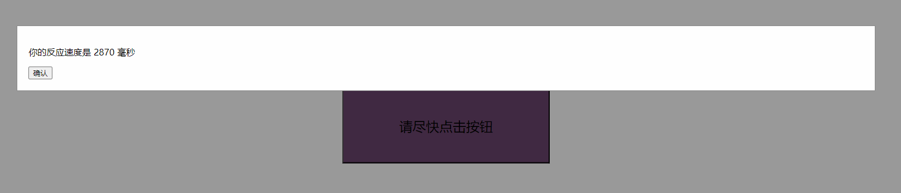

好的,这里是该游戏代码的 readme.md 文件:

# 点击游戏

这是一个用 HTML、CSS 和 JavaScript 实现的点击游戏。



## 游戏规则

- 点击开始游戏后,会出现一个颜色为随机色1的大按钮
- 按钮上显示“等待按钮颜色改变后立即点击”的提示文字  
- 在 3-8 秒的随机时间后,按钮颜色会变为随机色2
- 这时按钮提示改为“请尽快点击按钮”
- 如果在5秒内点击,则计算出反应时间并显示
- 如果未点击或点击太早,则提示失败并返回开始页面

## 实现方式

- 使用 HTML 和 CSS 实现界面
- JavaScript 处理交互逻辑
- 开始页面和结果提示使用模态框显示
- gameState 变量控制游戏状态  
- 生成随机颜色,计算时间差
- 简单的 CSS 美化界面

## 文件结构

- index.html - 游戏的 HTML 页面

## 使用方式

打开 index.html 即可开始游戏。

页面会显示开始游戏按钮。点击后即进入游戏流程。

## 注意事项

游戏时间和提示文本可根据需要调整。

可添加更多样式和动画来增强游戏体验。

欢迎提出改进意见!

## 代码来源

此代码由 Claude AI 模型根据最初给定的游戏需求提示生成。

原始需求提示:
```
- 使用HTML,CSS和JavaScript来实现
- 开始页面只包含一个居中的"开始游戏"按钮,使用CSS使其占满页面 
- 游戏页面包含一个居中的大按钮,使用CSS控制大小和位置
- 按钮初始化为随机颜色,文字提示"等待按钮颜色改变后立即点击"
- 如果在颜色1状态下点击,弹窗提示失败信息,返回开始页面
- 在3-8秒的随机时间内,按钮颜色改变为随机颜色2
- 颜色2状态下的按钮文字改为"请尽快点击按钮"  
- 如果在5秒内没有点击,提示失败信息,返回开始页面
- 如果在5秒内点击了,计算时间间隔并弹窗提示反应速度
- 弹窗包含反应速度信息,确认按钮返回开始页面
- 使用合适的CSS使按钮居中且适当大小
- 随机生成颜色,计算时间间隔要用Date对象
- 提示信息用模态对话框实现
- 对游戏过程进行逻辑控制和状态管理
- 代码要格式规范,注释清晰
- 尽量使界面美观大方,按钮反馈明显

```